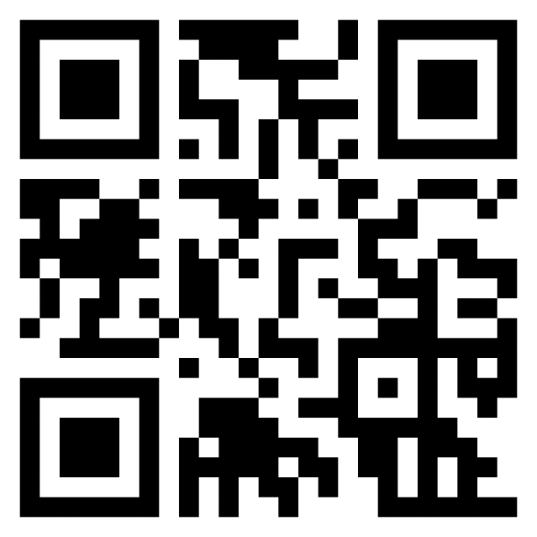

# QR code 

自傳
項次| 項目| 內容|
|---:|------|------|
|1|圖片 ||
|2|姓名| 詹忠諭|
|3|職稱| RT|
|4|公司| 儀光|
|5|高科大|學生|
|6|興趣| 打球 聽歌|

平常觀看的影片
<a href="https://www.youtube.com/watch?v=0mWesvS9XO0" target="_blank">赤鬼伯伯 </a>
 

 影片取自 youtube

## 工作經歷

(一)、 餐飲業-福客來中式宴客餐飲pt 
(二)、 製造業-造紙三級工廠 
(三)、 檢驗類-RT： 
  

RT介紹

RT（Radiographic Testing）射線檢測是一種常用的非破壞性檢測技術，利用射線透射原理來檢測物體內部的缺陷和異常。這項技術通常使用χ射線或γ射線作為射線源，將其照射到待檢測物體上，透過物體的吸收、散射和透射，形成一幅射線影像。

RT射線檢測能夠提供關於物體內部結構的詳細信息，例如焊接接頭、壓力容器、管道、鑄造件等。這些影像可以顯示出各種缺陷，如裂紋、氣孔、夾層、腐蝕等。透過對影像的分析和評估，檢測人員可以確定物體的品質和完整性，並作出相應的決策。

RT射線檢測廣泛應用於多個產業，包括航空航天、石油和天然氣、製造業等。在航空航天領域，RT檢測用於檢查飛機結構件和發動機零件，以確保其安全可靠。在石油和天然氣行業，RT檢測可用於檢查管道系統、鑽井設備和儲槽，以預防泄漏和故障。在製造業中，RT檢測可用於檢測焊接接頭、鑄造件和金屬結構，以確保其符合設計要求。

優點
1.         可用於任何金屬任何材質
2.         可同時檢測內部及表面瑕疵
3.         底片可做永久紀錄
4.         容易研判瑕疵種類與形式
5.         γ射線不需任何電源

